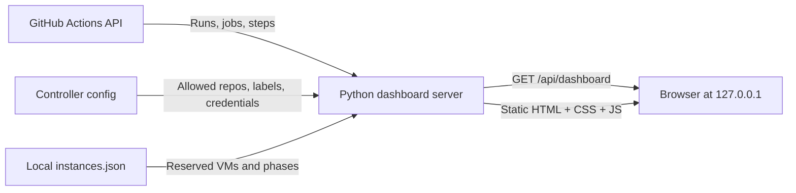

# CI Runners Monitor

**A local, read-only control room for GitHub Actions jobs running on disposable personal CI VMs.**

See the queue, running jobs, recent outcomes, runner capacity, and infrastructure incidents in one place. The dashboard combines the GitHub Actions API with the local reservation ledger from the [ci-runners controller](../ci-runners). It does **not** create, start, stop, or delete runners.

   

## What it shows

- **Live queue:** all observed queued and in-progress workflow runs, with job and repository filters.
- **Recent results:** pass rate, durations, trend, and per-repository/job breakdown from a recent window—not lifetime statistics.
- **Local capacity:** reserved VM slots, runner phase, and free disk space from the controller's state directory.
- **Actionable alerts:** controller issues appear before job failures; failed jobs link to GitHub when a safe URL exists.
- **Honest freshness:** separate GitHub fetch and local-read times, stale repository warnings, and explicit pagination-truncation alerts.

No build step, database, npm packages, or additional Python packages are required.

## Architecture



`server.py` reuses the controller's `personal_ci` configuration and GitHub transport. It queries **only the repositories listed in that configuration**; it never reads raw job logs. GitHub data is cached for 90 seconds, while the local VM ledger is read on each request. If one repository fails, other repositories still refresh and that repository's last good snapshot is marked stale. Merging local phases never changes the cached GitHub jobs.

The server binds only to `127.0.0.1` and rejects unexpected `Host` headers. API credentials stay on the server; the browser receives derived job metadata, not tokens or raw transport errors. **There is no authentication for other users or processes on your computer. Do not expose this service to the internet or proxy it without adding authentication.**

## Get started

1. Set up the [ci-runners controller](../ci-runners), including its `config.json`, GitHub credentials, and local state directory. Keep that configuration **outside this repository**.
2. Clone this repository anywhere on the **same host** as the controller:

   ```sh
   git clone https://github.com/OWNER/ci-runners-monitor.git
   cd ci-runners-monitor
   python3 server.py --config /absolute/path/to/ci-runners/config.json
   ```

3. Open **http://127.0.0.1:8765/**. Use `--port 8766` or another port if needed.

The directory containing `--config` must also contain the controller's `personal_ci` package. Python 3.9+ is required. The controller must be configured and running separately to execute jobs; this dashboard only observes them.

### Optional: start at login on macOS

Copy [`launchd/monitor.example.plist`](launchd/monitor.example.plist) to `~/Library/LaunchAgents/local.ci-runners-monitor.plist`. Replace **every** `/absolute/path/to/...` placeholder with the real absolute paths, and set the Python interpreter path if `/usr/bin/python3` is unavailable. Then:

```sh
launchctl bootstrap "gui/$(id -u)" "$HOME/Library/LaunchAgents/local.ci-runners-monitor.plist"
launchctl print "gui/$(id -u)/local.ci-runners-monitor"
```

To stop it: `launchctl bootout "gui/$(id -u)/local.ci-runners-monitor"`. This template contains no machine-specific paths or credentials.

## Data and limits

The recent-result window includes the **10 latest workflow runs per repository** plus all discoverable queued/in-progress runs. Active runs and their jobs are paginated in batches of 100, with a safety ceiling of 100 pages per list. `coverage.truncated_repos` identifies repositories where an API result window or that ceiling prevented complete collection; it does **not** claim lifetime coverage. Durations require usable GitHub timestamps.

The browser refreshes every 20 seconds; a fresh page render does not imply a fresh GitHub fetch. `github.fetched_at` is the **most recent** successful repository fetch, `github.repos[]` holds each repository's own fetch time and stale status, and `updated_at` is the local read time. When GitHub is unavailable, last-good data remains visible with a warning. Local VM occupancy is shown independently of GitHub's job status.

## Verify

```sh
python3 -m unittest discover -s tests -v
curl -fsS http://127.0.0.1:8765/api/dashboard | python3 -m json.tool >/dev/null
```

The tests use fake API responses and a temporary ledger; they do not require GitHub access, credentials, or a running controller.

## License

MIT — see [LICENSE](LICENSE).
